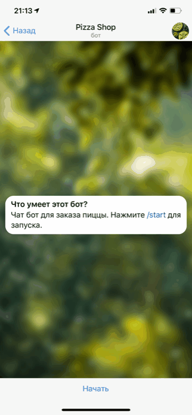
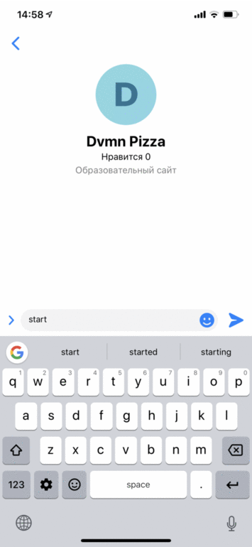

# Bot for pizza shop

It's the bot for pizzerias shop based on Moltin.

You can find it bot in Telegram: @dvmn_pizzashop_bot

The bot can show all products, choose a product, and show its description and its image. You can buy pizza or several pizzas and place your order. To place your order, send your location via bot and pay the order via bot.

Temporality users data stored in Redis.

Bot in Telegram:



Bot in FB Messanger:



## How to install

1. Create your online shop on [Moltin](https://www.moltin.com), and create your goods. Get your Client ID and Client secret.

2. Create a bot in Telegram @via BotFather, and get it API token.

3. via @BotFather choose your bot, choose Payments and bank for your payments. And get Bank token.

4. Create redis account in [Redislabs](https://redislabs.com/), and after that create [cloud database](https://docs.redislabs.com/latest/rc/quick-setup-redis-cloud/) (you can choose free plan). Get your endpoint database url and port.

5. Create page in Facebook, create [Facebook's app](https://developers.facebook.com/apps/) and setting messenger permissions for it. You need to choose `messages` and `messaging_postbacks`. Get access token and write it into .env. Plug in webhook into your app.

Create file .env in the root and write in it:

```.env
MOLTIN_CLIENT_ID=your moitin client id
MOLTIN_CLIENT_SECRET=your moltin secret key
TG_TOKEN=your telegram bot's token
TG_TRANZZO_TOKEN=bank token for payments
PAYMENT_PAYLOAD=you very secure payload
REDIS_URL=redis database endpoint without port
REDIS_PORT=redis database port
REDIS_PASSWORD=redis password
FB_PAGE_TOKEN=your token from FB app
FB_VERIFY_TOKEN=digits for verify your webhook
```

Python3 must be already installed.

Should use virtual env for project isolation.

Then use pip (or pip3, if there is a conflict with Python2) to install dependencies:

```bash
pip install -r requirements.txt
```

## How to use

To run telegrem bot:

```bash
python tg_bot.py
```

To run facebook bot you must configure Flask webhook on the server:

To run locally use `ngrok` and run script:

```bash
python fb_bot.py
```
